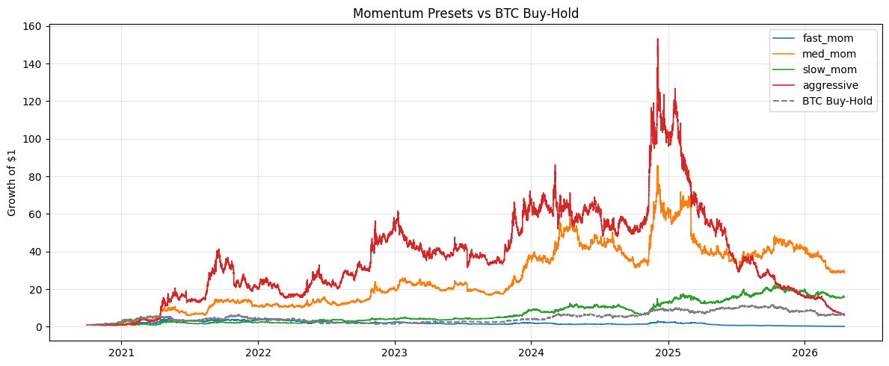
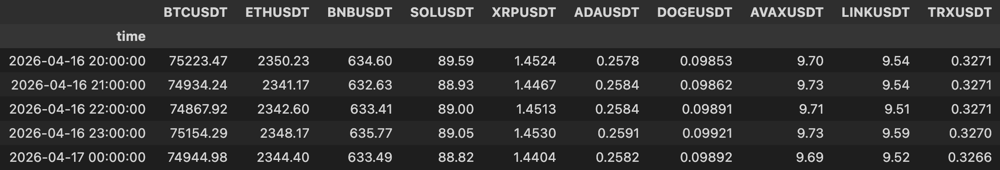
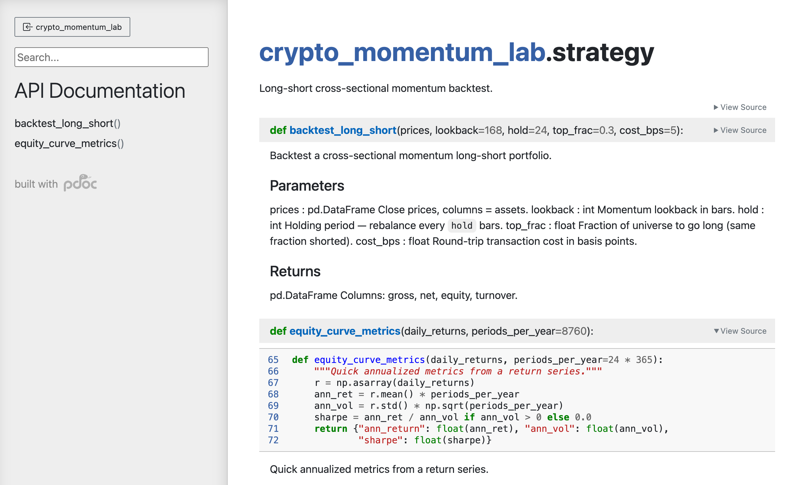

# crypto_momentum_lab

A parallel cross-sectional momentum strategy backtester for top crypto pairs
on Binance, featuring parameter grid search, multi-strategy comparison,
transaction cost modeling, and comprehensive risk analytics.



## Team

- **Boqian (David) Niu (bn287)** — Data pipeline, parallel grid search, demo notebook, README.md
- **Zixi (Roxana) Ji (zj277)** — Signals, strategy engine, backtest presets, CLI, HTML documentation
- **Peijie Li (pl675)** — Risk analytics, visualization module, tests

## Demo

The main walkthrough of the project — including data exploration, backtests,
grid search results, and all visualizations — is in
[`notebooks/demo.ipynb`](notebooks/demo.ipynb). We recommend starting there.

## Features

- **Cross-sectional momentum** long-short strategy on 10 USDT crypto pairs
- **Parallel grid search** over (lookback, hold, top_frac) via `multiprocessing.Pool`
- **Multi-preset comparison** — run fast/medium/slow/aggressive momentum in parallel
- **BTC buy-and-hold benchmark** for relative performance assessment
- **Transaction cost** modeling in basis points
- **Risk analytics**: Sharpe, Sortino, max drawdown, VaR, CVaR
- **Visualization suite**: equity curves, drawdowns, Sharpe heatmaps, rolling Sharpe
- **HTML documentation** via pdoc
- **>80% unit test coverage** using `FakePool` mock pattern
- **No look-ahead bias**: positions lag signals by 1 bar

## Dataset

Hourly OHLCV klines downloaded from the
[Binance Vision public data archive](https://data.binance.vision/) as monthly
zip files. No API key is required. Data is automatically cached as parquet
files in the `data/` directory after the first download.

Default universe: BTC, ETH, BNB, SOL, XRP, ADA, DOGE, AVAX, LINK, TRX.



> **Note for US-based users:** The Binance data archive may be inaccessible
> from US IP addresses. If downloads fail or time out, connect through a VPN
> with a location set outside the United States before running the data loader.

## Install

```bash
git clone https://github.com/NBQian/ORIE-5270-FInal-Project.git
cd crypto_momentum_lab
pip install -e .
```

## Run

```bash
# Interactive demo (recommended starting point)
jupyter notebook notebooks/demo.ipynb

# Grid search (parallel)
python -m crypto_momentum_lab.cli grid --n_workers 8

# Compare preset strategies vs BTC buy-and-hold
python -m crypto_momentum_lab.cli backtest --n_workers 4

# Run all tests
python -m unittest discover tests -v

# Generate HTML docs (see below)
pip install pdoc
python docs/generate_docs.py
```

## Documentation

Full API documentation is auto-generated from docstrings using
[pdoc](https://pdoc3.github.io/pdoc/). To generate or update:

```bash
pip install pdoc
python docs/generate_docs.py
```

The HTML docs are output to `docs/html/` and include pages for every module:
`data_loader`, `signals`, `strategy`, `risk`, `parallel_grid`, `backtest`,
`visualization`, and `cli`. Open `docs/html/index.html` in a browser to
browse the full API reference.



## Project Structure

```
crypto_momentum_lab/
├── README.md
├── setup.py
├── .gitignore
├── crypto_momentum_lab/
│   ├── __init__.py
│   ├── data_loader.py       # Binance kline fetcher + parquet cache
│   ├── signals.py            # momentum, vol, cross-sectional ranks
│   ├── strategy.py           # long-short backtest engine
│   ├── risk.py               # Sharpe, Sortino, drawdown, VaR/CVaR
│   ├── parallel_grid.py      # parallel hyperparameter search
│   ├── backtest.py           # multi-strategy preset runner
│   ├── visualization.py      # plotting utilities
│   └── cli.py                # command-line interface
├── tests/
│   ├── test_data_loader.py
│   ├── test_signals.py
│   ├── test_strategy.py
│   ├── test_risk.py
│   ├── test_parallel_grid.py
│   ├── test_backtest.py
│   └── test_visualization.py
├── notebooks/
│   └── demo.ipynb
└── docs/
    ├── generate_docs.py
    └── html/                 # auto-generated API reference
        ├── index.html
        └── crypto_momentum_lab/
            ├── data_loader.html
            ├── signals.html
            ├── strategy.html
            ├── risk.html
            ├── parallel_grid.html
            ├── backtest.html
            ├── visualization.html
            └── cli.html
```

## Methodology

1. Pull hourly closes for 10 USDT pairs from Binance (Oct 2020 – Apr 2026)
2. Compute cross-sectional momentum signal (past-N-bar return, skip 1 bar)
3. Rank assets each period; long top quantile, short bottom quantile
4. Hold for H bars, apply 1-bar position lag, charge round-trip cost
5. Grid-search (lookback, hold, top_frac) in parallel; rank by Sharpe
6. Compare named presets against BTC buy-and-hold benchmark

## Git Workflow

Feature-branch workflow with three contributors. See `GIT_PLAN.md` for the
full step-by-step collaboration sequence.

## License

MIT
